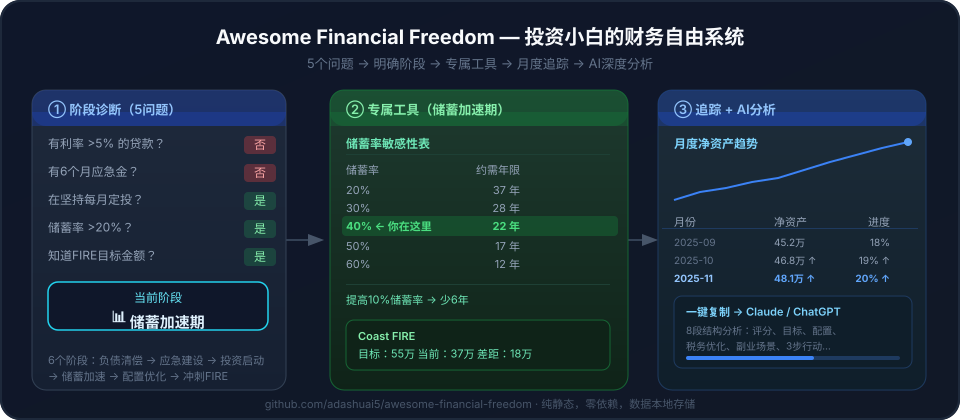

# Awesome Financial Freedom 🕊️

[English](./README.md) | [简体中文](./README.zh-CN.md)

> 回答5个问题 → 明确你的FIRE阶段 → 获得专属工具 → 月度追踪进度 → 一键发给AI深度分析。
> 为不知道从哪开始的投资小白而建，不只是给能读JSON的开发者。

**创建日期**: 2026-04-12 · **最后更新**: 2026-04-26

## 🧭 快速导航

- **演示**: [`https://adashuai5.github.io/awesome-financial-freedom/demo/`](https://adashuai5.github.io/awesome-financial-freedom/demo/) (在线，无需安装)
- **Playbooks**（指南 + 教程）: [`playbooks/guides/`](playbooks/guides)
- **知识节点**: [`knowledge/nodes/`](knowledge/nodes)
- **工作流**: [`workflows/`](workflows)
- **Prompts & Agents**: [`prompts/`](prompts) · [`agents/`](agents)
- **Skills & Tools**: [`skills/`](skills) · [`tools/`](tools)
- **书籍摘要**: [`playbooks/book-summaries/`](playbooks/book-summaries)

## 🤔 这是什么？

**Awesome Financial Freedom** 是一个面向中国投资者的开源、AI 原生 FIRE 规划系统。结构化知识、确定性计算器、阶段化引导 UX 三合一，让投资小白知道今天该做什么——而不只是"数学上20年后能退休"。

核心组件：

- 🎯 **5题阶段诊断** — 30秒内定位你的FIRE阶段（负债清偿 → 应急建设 → 投资启动 → 储蓄加速 → 配置优化 → 冲刺FIRE）
- 🛠️ **6套阶段专属工具** — 债务雪崩/雪球计算器、应急金进度条、DCA收益模拟、储蓄率敏感性表、再平衡检查清单、Coast FIRE计算
- 📊 **扩展FIRE计算器** — 收入增长模拟、副业场景对比、退休生活方式对比（大城市/二线/东南亚套利/极简）、Coast FIRE检查
- 🏦 **中国市场特化** — 综合所得税档 + 专项附加扣除 → "税后真实储蓄率"；个人养老金（12000元/年抵税）；公积金优化；ETF代码（510300/513500/518880）
- 📊 **多方案对比器** — 保存 2-4 个方案（如"现状/加薪 10%/副业 3k/搬清迈"），并排展示 FIRE 年限差异
- 💾 **月度快照追踪** — localStorage 存储，折线图，趋势箭头，**支持 CSV / JSON 导出**，无需后端
- 🧠 **29 个 JSON 知识节点** — 计算结果旁内联展示相关知识卡（含 limitations）
- 🤖 **一键 AI 分析（BYOK）** — 填入自己的 Anthropic API key（仅存浏览器），直连 Claude 流式输出 8 段分析；或复制 prompt 给任意 LLM

## 🎯 目标用户

- 想要一条直接通往财务自由的路径和可执行步骤的人
- 想存钱但不知道从哪开始年轻职场人
- 听说过 FIRE 但不知道怎么算的人
- 希望 AI 帮助规划财务的人
- 想把财务策略转化为可执行计划的人

## ✨ 为什么要做这个？

互联网上充斥着个人理财博客、付费课程和零散建议。但**没有一个开源、结构化、AI 就绪的财务自由执行系统**，专门帮助人们把计划变成行动。

这个项目填补了这个空白：提供一个**社区驱动、透明、可执行的 AI 规划系统**。核心创新在于将结构化工作流、Prompt 模板和计算器逻辑整合为一个可用的执行引擎。

## 📚 知识来源

- FIRE 数学：4% 法则、Trinity Study（[Wikipedia](https://en.wikipedia.org/wiki/Trinity_study)）
- 双轮配置（沪深300 + 标普500 + 黄金 + 债券）
- 中国第三支柱养老金（个人养老金）规则
- FIRE 社区关于储蓄率、Coast FIRE、地理套利的研究
- 更多来源见 [`playbooks/book-summaries/`](playbooks/book-summaries/)

## 🔧 如何使用

### 1️⃣ 立即体验（无需安装）

打开 **`https://adashuai5.github.io/awesome-financial-freedom/demo/`**

页面第一件事：5个是/否问题，30秒内定位你的FIRE阶段，对应工具自动加载——不需要读完整计算器。

### 2️⃣ 填入你的数字（可选但建议）

主表单需要：年龄、收入、支出、各类资产（银行/公积金/股票/房产）、负债、风险偏好。新增字段：个人养老金缴费、收入增长率、副业月收入、目标退休年龄、退休生活方式。

### 3️⃣ 深入探索

拿到一次结果后，可深入了解系统：

| 如果你想… | 去哪里 |
|----------|--------|
| 本地运行 + AI 助手 | [`playbooks/tutorials/getting-started.md`](playbooks/tutorials/getting-started.md) |
| 了解系统设计 | [`playbooks/guides/money-os-architecture.md`](playbooks/guides/money-os-architecture.md) |
| 通过 CLI 执行 | `node tools/run-workflow.js workflows/fire_planning.yaml`（需 Node.js ≥18） |
| 浏览全部工作流 | [`workflows/`](workflows) |

## 📖 知识结构

七个从心态到财务自由的递进阶段：

| 阶段 | 目录 | 你将学到 |
|------|------|---------|
| 01 — 心态 | [`knowledge/nodes/01-mindset/`](knowledge/nodes/01-mindset) | 财务自由真正意味着什么；钱是工具而非目标 |
| 02 — 基础 | [`knowledge/nodes/02-foundation/`](knowledge/nodes/02-foundation) | 应急基金、保险、消除高息债务 |
| 03 — 积累 | [`knowledge/nodes/03-accumulation/`](knowledge/nodes/03-accumulation) | 提高储蓄率；副业收入；复利基础 |
| 04 — 配置 | [`knowledge/nodes/04-allocation/`](knowledge/nodes/04-allocation) | 资产配置、多元化、指数基金、再平衡 |
| 05 — 自动化 | [`knowledge/nodes/05-automation/`](knowledge/nodes/05-automation) | 自动储蓄和投资，让纪律成为自动习惯 |
| 06 — 自由 | [`knowledge/nodes/06-freedom/`](knowledge/nodes/06-freedom) | FIRE 数学、安全提取率、Coast FIRE、Barista FIRE |
| 07 — 学习路径 | [`knowledge/nodes/07-learning-path/`](knowledge/nodes/07-learning-path) | 阶段路线图；下一步该读哪个节点 |

## 🤝 贡献

欢迎贡献！请阅读 [`CONTRIBUTING.md`](CONTRIBUTING.md) 了解：
- 如何报告问题或建议新知识节点
- Pull Request 工作流和编码风格
- 如何添加 Prompts、工作流或 Playbook 内容

## 📄 许可

- **知识内容**：采用知识共享署名-相同方式共享 4.0 国际协议（CC BY-SA 4.0）——详见 [LICENSE](LICENSE) 文件。
- **代码与工具**：采用 MIT 协议——详见 [LICENSE-CODE.md](LICENSE-CODE.md) 文件。